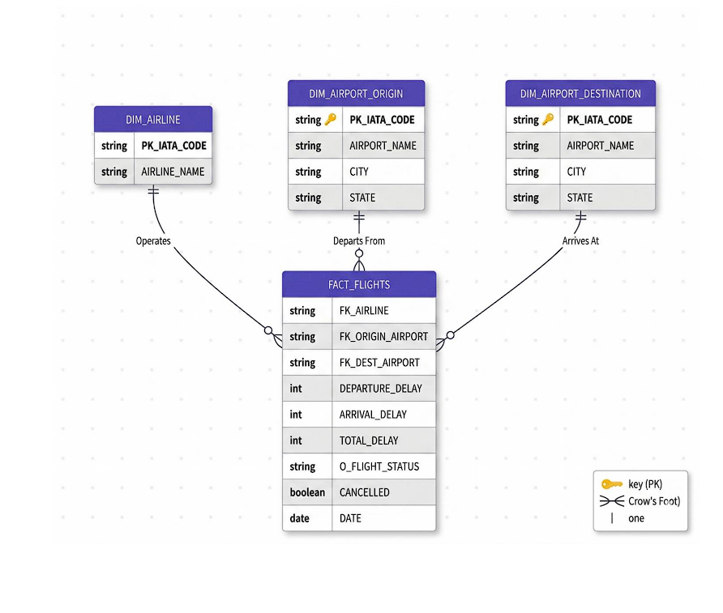

Aviation Data Warehouse for Flight Delay Analytics
A comprehensive enterprise Data Warehouse engineered using Informatica Intelligent Data Management Cloud (IDMC) and Microsoft Power BI. This project integrates, cleanses, and analyzes massive commercial aviation datasets to deliver actionable business insights into operational delays, airline performance, and geographic flight tracking.

Table of Contents
Project Overview
Features
Technologies Used
Database Structure
Schema Diagram
Data Transformations
Business Insights
Contributors
License
Project Overview
The Aviation Data Warehouse centralizes critical daily operational data, processing millions of raw flight logs alongside master reference files for airports and airlines. This system empowers aviation authorities and data analysts to overcome the challenges of distributed, messy flat files (CSVs) by providing structured relationships and pre-calculated performance metrics.

By leveraging Informatica IDMC, this project automates the extraction, transformation, and loading (ETL) of unstructured data into a highly optimized relational Star Schema, which directly powers an interactive downstream business intelligence dashboard.

Features
Large-Scale Data Integration: Merges fragmented datasets (~600MB of flight, airline, and airport data) into a unified data warehouse.
Complex Data Transformation: Cleanses raw data through deduplication, surrogate key generation, categorical unpivoting, and targeted aggregations.
Dynamic Event Routing: Conditionally splits data streams in real-time, routing flights into dedicated analytical tables based on delayed vs. on-time status.
Business Intelligence: Features an interactive "Master Operations Dashboard" for root-cause delay analysis and high-level KPI tracking.
Automated Outlier Detection: Identifies extreme performance anomalies, such as isolating the 50 worst departure delays (excluding cancellations).
Technologies Used
Informatica IDMC: Cloud-based Data Integration, ETL Pipelines, and Data Engineering.
Microsoft Power BI: Data Visualization, Dashboard Engineering, and Analytics.
Relational Database Design: Star Schema Architecture for high-performance querying.
Database Structure
Key Entities:

FACT_FLIGHTS: The central fact table tracking historical logs, scheduled times, departure/arrival delays, and total delay metrics.
DIM_AIRPORT_ORIGIN: Dimension table storing the official names, cities, and states of departure airports.
DIM_AIRPORT_DESTINATION: Dimension table storing the official names, cities, and states of arrival airports.
DIM_AIRLINE: Dimension table mapping unique surrogate keys and IATA codes to full corporate airline names.
Relationships:

Flights are geographically linked to Origin and Destination Airports via IATA Codes.
Flights are operationally linked to Airlines via standardized Surrogate Keys.
Schema Diagram
Below is the Star Schema architecture designed for this data warehouse:

(Note: Replace this text with your actual schema image. Example: )

Data Transformations
Key ETL transformations executed within Informatica IDMC:

Reference Deduplication (Sorter): Cleansed and removed duplicate entries from raw airport datasets.
Surrogate Key Generation (Sequence Generator): Replaced text-based airline codes with numeric IDs to optimize database lookup performance.
Delay Logic Routing (Router & Expression): Calculated total delay times and conditionally routed flights based on performance thresholds.
Categorical Normalization (Normalizer): Unpivoted wide-layout root-cause delay data into a tall layout to ensure compatibility with BI visualization tools.
Executive Aggregation (Aggregator): Compressed millions of individual flight records into lightweight, executive summaries (e.g., average delay time per airline).
Business Insights
The Power BI Master Operations Dashboard provides the following critical insights:

Executive KPIs: Real-time monitoring of total flight volumes (6M+) and cumulative system delay minutes (25M+).
Root-Cause Analysis: Categorization of primary delay drivers, including weather, security, airline operations, and local system failures.
Operational Benchmarking: Comparative analysis of average delay times across major commercial airlines.
Geographic Tracking: Chronological, step-by-step route mapping of specific aircraft tail numbers across the national network.
Contributors
Tushar Singh
Rahul Ranjan
Priyanshu Khatri
Abhinandan
Project Guide: Mr. Channabasappa Muttal

License
This project was developed for educational purposes as part of the Bachelor of Engineering curriculum in Computer Science and Engineering at KLE Technological University.
